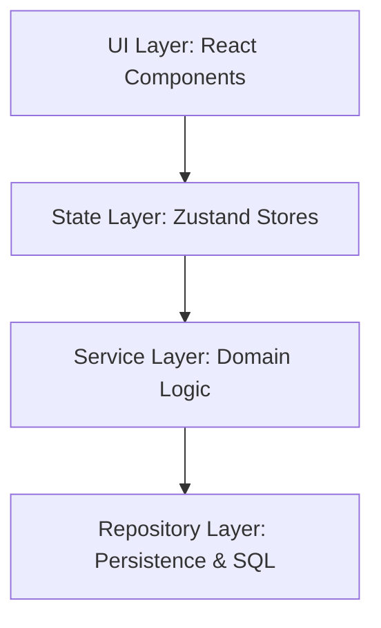

# ASTRA Engineering Playbook

This document is the permanent operating manual for anyone contributing to Project Astra (whether human or agentic AI). It details the core engineering standards, architecture constraints, and review workflows that preserve Astra's quality, philosophy, and code integrity.

---

## 1. Engineering Philosophy & Principles

Astra is not a typical productivity utility. It is designed to be a calm sanctuary for students sitting alone at a desk. Every engineering choice must prioritize the student's focus, privacy, and peace of mind.

### A. Core Axioms
1.  **Trust is the Final Measure**: The student must trust that their logs are secure, their work is never lost, and Astra's presence is quiet and respectful.
2.  **Calm & Restraint over Engagement**: Astra does not employ gamification or high-engagement mechanics (e.g. notifications, metrics dashboards, daily prompts). Success is defined by the student closing the app to go study.
3.  **Local-First & Private**: The application runs completely offline. No telemetry, behavioral analysis, or crash collection beacons are active.

### B. First Session vs. Millionth Session
*   **The First Session Experience**: Must feel effortless. Minimal onboarding, zero setup wizards, no mandatory cloud registrations, and absolute silence by default.
*   **The Millionth Session Experience**: Must remain performant. Database indexes are optimized for years of daily data history. State machines reset cleanly to `'idle'` to ensure the app never becomes bloated or sluggish over a five-year journey.

---

## 2. Architecture & Design Rules

Astra strictly segregates data, states, and business logic into isolated layers. Blurring these boundaries creates tight coupling and compromises reliability.



### A. Subsystem Design Rules
Every new subsystem added must document and honor four metadata sections:
1.  **Ownership**: What specific database schemas, state properties, or components does the subsystem own?
2.  **Depends On**: Which other subsystems may it call or query?
3.  **Used By**: Which subsystems are expected to consume its output?
4.  **Must Never Know About**: Which domains, parameters, or configurations must remain completely hidden from it?

### B. Layer Responsibilities
*   **Repositories (Persistence)**: Exclusively handle SQLite SELECT, UPDATE, INSERT, and DELETE operations. They must contain no business logic.
*   **Services (Business Logic)**: Coordinate complex workflows, intervals, filesystem operations, and mathematical calculations. They must never directly invoke component renders.
*   **Stores (Zustand State)**: Keep the active frontend application status (routing, active session fields, lists). They are simple containers and must not carry out raw SQLite queries.
*   **UI Components (React)**: Render layout styles and bind event handles to service routines. They must contain no database queries or timer intervals.

### C. Data Modeling Rules
*   **No Stored Derived Data**: Never persist values (like study streaks, daily totals, or weekly metrics) that can be dynamically calculated from raw log files on startup.
*   **Strict Typing**: Always use type-safe abstractions (`MemoryTier`, `MemoryCategory`, `SessionStatus`) throughout the codebase rather than raw, arbitrary string constants.

---

## 3. Implementation Lifecycle & Workflow

Any change to the Astra codebase must pass through the following systematic lifecycle:

```
[Scope Assessment] ──> [Research & Plan] ──> [Critical Plan Review] ──> [Code Execution] ──> [Verification]
```

### A. Scope Assessment
Before coding, evaluate if the change warrants an **Implementation Plan**:
*   *Plan Required*: Schema migrations, new repository interfaces, state changes, or architectural shifts.
*   *No Plan Needed*: Documentation additions, simple UI alignment tweaks, or straightforward syntax fixes.

### B. Implementation Plan Reviews
Every plan must be evaluated against the following checklists:

#### UX Review
*   Does it present clear, obvious next actions?
*   Are unfinished features represented with honest placeholder language (e.g. *"Coming Soon"*)?
*   Is it free from distracting micro-notifications or nag alerts?

#### Philosophy Review
*   Does it protect student autonomy and trust?
*   Are manual settings overrides preferred over automated, non-deterministic system changes?
*   Does it remain completely local-first?

#### Architecture & Data Review
*   Is the responsibility boundaries model preserved?
*   Does it avoid storing duplicate/derived data?
*   Are database tables properly normalized and indexes optimized?

#### Scaling & Performance Review
*   Does the query performance remain $O(\log N)$ or better as rows scale to thousands?
*   Does the startup boot pipeline complete under the 1.5-second limit?
*   Is memory footprint growth controlled?

#### Security & Simplicity Review
*   Are credentials and local data securely handled?
*   Does it use the simplest possible code structures, avoiding premature abstractions and "framework building"?

---

## 4. Documentation Standards

### A. Architecture Decision Records (ADRs)
An ADR must be created whenever a decision affects the long-term system architecture (e.g. database schema transformations, service boundaries, or state models). Write ADRs to the `docs/reviews/` folder, numbering them sequentially.

### B. What Must Always Be Documented
*   Any database migration addition.
*   New repository schemas and type declarations.
*   Integration points between Tauri native windows and React web hooks.
*   Intentional compromises or technical debt introduced (which must be recorded in the `Technical Debt` review section of the implementation plan).

### C. Bug Tracker
The [Bug_Tracker.md](file:///c:/Projects/ASTRA/docs/Bug_Tracker.md) is a required document in the engineering workflow and serves as the single source of truth for all software defects.
*   **Recording**: Any bug discovered must be recorded immediately in [Bug_Tracker.md](file:///c:/Projects/ASTRA/docs/Bug_Tracker.md).
*   **Lifecycle**: Bugs must move through the Open → In Progress → Fixed lifecycle, and fixed bugs must remain permanently for historical tracking.
*   **Verification**: No bug can be moved to Fixed without direct verification of the resolution.
