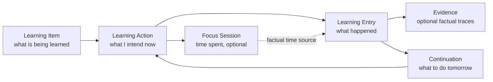

# Learning Record Architecture v1

## Status and authority

This is the canonical product-architecture design for Astra's Learning Record. It implements the direction of Product Principles and ADR-0004 without prescribing database tables, TypeScript interfaces, or implementation technology.

It is intentionally narrower than a “second brain,” a curriculum engine, or an AI profile. Its job is continuity: preserve enough truthful context for a person to resume learning tomorrow.

## The philosophy before the model

Learning is not a sequence of perfectly completed tasks. People learn in short attempts, long stretches, false starts, revision, frustration, discovery, practice, and return. A system that asks users to narrate all of that becomes work itself. A system that reduces all of it to minutes, streaks, or checkboxes becomes dishonest.

The Learning Record must therefore preserve **only enough evidence to make the next learning decision easier**.

It has four commitments:

1. **Continuity over capture.** The highest-value output is knowing where to resume, not producing an exhaustive journal.
2. **Facts before interpretation.** “Solved 7 of 10 questions” and “need to revisit recursion” are valid evidence. “You are weak at algorithms” is an interpretation and cannot become truth automatically.
3. **Student authority over automation.** The student owns the record, can correct it, and decides what counts as progress.
4. **Recording costs less than learning.** Any interaction that repeatedly costs more than a few seconds must be optional, delayed, or removed.

## Challenge to the starting hypotheses

### A session is not the source of truth—and it should not automatically produce a record

The useful distinction is:

- A **focus session** is a time-bounded event: the student spent time attempting work.
- A **Learning Entry** is a durable statement that helps future continuation.
- The **Learning Record** is the student-owned collection of Learning Entries and their evidence.

A session can be linked to an entry, but it is not proof that learning happened. Conversely, a Learning Entry can exist without a timer: a mock score, a bug fixed, a lecture completed, a realization recorded after class, or a decision to revisit something.

Do not create a detailed entry merely because a timer ended. If the student closes the laptop, preserve the factual session safely and treat its outcome as unknown. Tomorrow, Astra may offer a quiet continuation—not demand a retrospective explanation.

### “Progress” must not be a field that pretends to be objective

Progress is contextual and may be temporal, practical, conceptual, or goal-related. Astra should record evidence and a student's stated outcome. It should not maintain a universal percentage, mastery score, or confidence truth without an explicit, domain-appropriate source.

### No universal learning taxonomy is required at v1

The product must work for programming, music, languages, research, writing, exams, and professional skills. Attempting to define all activity types up front would create a brittle form system and turn Astra into a generic productivity database.

Start with a small common language. Let contextual templates emerge only when there is repeated evidence they reduce work.

## The durable abstractions

### 1. Learning Item — the recommended core anchor

A **Learning Item** is the smallest persistent thing a student is trying to understand, practice, create, or improve.

Examples:

- “Projectile motion: relative velocity”
- “Pointers and ownership in Rust”
- “Spanish past tense”
- “Bach Prelude No. 1, bars 17–24”
- “Literature review methodology”
- “Client onboarding presentation”

This—not Subject, Project, Skill, Domain, or Action alone—is Astra's primary abstraction for the next decade.

Why:

- A **subject/domain** is often too broad to resume.
- A **project** may contain learning, but can also be delivery work.
- A **skill** is durable but often too abstract to act on today.
- An **action** is useful now but disappears when completed or deferred.
- A **Learning Item** can represent a concept, technique, artifact, question, chapter, lesson, exercise set, or practice passage without assuming a school curriculum.

Learning Items may be optionally grouped under user-defined Areas or projects for navigation. Those groups are organizational aids, never the truth of what learning is. Astra does not need a mandatory hierarchy to deliver its first learning loop.

### 2. Learning Action — the present intention

A **Learning Action** is a bounded, student-confirmed intention against one Learning Item.

Examples:

- “Solve ten relative-velocity problems.”
- “Recall the past-tense endings without notes.”
- “Read and annotate the methodology section.”
- “Practice bars 17–24 slowly.”

It answers: **What am I doing now?**

An action is not a task-manager primitive. It is a temporary learning commitment. It can be started, paused, completed for now, deferred, abandoned, or revised. Completing an action never automatically means the Item is mastered.

### 3. Learning Entry — the durable continuation event

A **Learning Entry** is the minimal durable account of something relevant that occurred while learning. It connects a Learning Item to one or more facts, a student-reported outcome, or a deliberate future cue.

Examples:

- “Reviewed relative velocity for 25 minutes; needs another pass on frame selection.”
- “Mock test: 58/100; errors concentrated in questions 12–16.”
- “Fixed null-pointer bug in parser; add a test for empty input.”
- “Completed lecture 4; revisit the proof of theorem 2.”

An entry is the unit that makes tomorrow possible. It is not a diary post, a grade, or a claim of mastery.

### 4. Evidence — a factual trace, not a score

**Evidence** is a concrete observation the student chooses to leave behind. It can be numerical, textual, referential, or artifact-based.

Valid evidence includes:

- questions attempted or correct;
- a score with its scale/context;
- pages or lecture segment completed;
- a practice attempt or artifact completed;
- a commit made or bug fixed;
- a future note: “start with the failing test tomorrow”;
- a realization or uncertainty in the student's own words.

Evidence is not inherently progress. “20 questions attempted” does not mean learned; “90% on a mock” does not explain transfer or retention. Astra keeps the fact, its context, and its source separate from any later interpretation.

### 5. Continuation — the product output

A **Continuation** is a concise, editable statement of where the student left off and what can reasonably happen next. It can be generated deterministically from the latest action/entry, supplied by the student, or later proposed by AI.

Examples:

- “Continue with two frame-selection examples.”
- “Retry the first three failed questions before taking another timed set.”
- “Read the parser test failure before changing code.”

Continuation is not a mandatory separate object in the first implementation. It is the product behavior the Learning Record must enable.

## Relationship between concepts

The arrows are deliberately not all mandatory. A timed session may end with no entry. A manual entry may exist with no session. An action may be created without starting immediately. This tolerates normal human behavior.

## What belongs in a Learning Entry

The following are product concepts, not a proposed schema.

### Always required when an entry is created

- **When it was recorded.** Astra supplies this; the student never types it.
- **Who/what created it.** Student, imported factual source, or later AI proposal. AI-created material cannot silently become a confirmed student record.
- **What it concerns.** A linked Learning Item when available, or a short student label when it is not. The product must not block a useful entry because hierarchy setup is incomplete.
- **A minimal state.** For example: continuation available, complete for now, deferred, or outcome unknown. This is operational, not a mastery judgment.

### Usually optional

- Time spent or linked focus session.
- A one-tap outcome: **moved forward**, **partly moved forward**, or **needs another attempt**.
- One short next-time cue.
- Free-text note.
- Evidence values, units, score context, artifact references, or attachments.
- Tags/groups supplied by the student.

### Never requested as a default completion requirement

- A long reflection.
- A mood report, productivity rating, or explanation for a lapse.
- A confidence percentage.
- A declaration of mastery.
- A detailed plan for tomorrow.
- A numeric score when the learning activity did not naturally produce one.
- Any field whose only purpose is analytics or AI training.

The product may progressively reveal optional evidence capture when it is immediately useful. It must never punish the student for skipping it.

## The minimum viable record

For an exhausted student ending a 15-minute attempt, the entire required interaction can be:

> “How did this go?”  
> **Moved forward** · **Partly** · **Need another attempt** · **Close without recording outcome**

If the student chooses “Close without recording outcome,” Astra saves the factual session if one exists and does nothing else. The next opening can say, quietly: “You last worked on relative velocity. Continue or choose something else?”

This is not a missing-data failure. It is a respectful design for real life.

## Editing, corrections, and history

Students must be able to correct their own records. Learning is often understood retrospectively, and data ownership without correction is hollow.

### Editing rule

- The visible record should be easy to edit or correct.
- Durable history should preserve that a correction occurred, without forcing a student to manage an audit log.
- A correction supersedes the earlier visible value; it does not erase the original fact without an explicit delete request.
- Deletion is permitted for student-owned entries. Deleted material must not be used by future recommendations or AI context.

### Why history is justified

The complexity is justified only because planning, analytics, and eventual AI must not silently reinterpret past evidence. A lightweight revision history protects trust and recovery. It must remain invisible unless the student needs it; Astra is not a version-control interface.

## AI interaction rules

AI can interact with the Learning Record only as a proposal layer.

### Permitted

- Summarize student-selected entries.
- Suggest a clearer continuation from explicitly linked evidence.
- Propose an optional Learning Item label or grouping.
- Propose a reminder/revision action with stated evidence.
- Flag ambiguity: “You recorded two different next steps. Which should remain active?”

### Prohibited

- Declaring a Learning Item mastered, weak, forgotten, or complete.
- Writing an interpretation as confirmed evidence.
- Creating a personal profile from sparse records.
- Inferring emotional, cognitive, medical, or motivational traits.
- Changing plans, priorities, groups, or records without confirmation.
- Filling every record with generated text.

Every AI proposal must display its source entries and have accept, edit, reject, and dismiss behavior. The offline deterministic continuation must remain useful when AI is absent.

## Planning and analytics

### Planning

Planning begins with continuity, not optimization. The first planning question is:

> “What is the most reasonable thing to continue?”

Planning may use: an unfinished action, a student-authored next cue, an explicitly due revision, a chosen deadline, or factual evidence of an unresolved attempt. It must disclose the reason and let the student choose another action.

It must not start by inventing a global productivity score, ranking the student's worth, or automatically scheduling every free hour.

### Analytics

Analytics should be a view over facts and entries, not a separate system that manufactures progress.

Useful future views include:

- actions attempted, continued, deferred, or completed for now;
- evidence types over time;
- revision commitments kept or rescheduled;
- time as context alongside outcomes;
- a student-selected view of an Item's history.

Analytics must label unknown outcomes as unknown. It must never infer learning from minutes alone or merge heterogeneous evidence into a single misleading score.

## Universality without generic-product sprawl

Astra remains universal by supporting the shared learning primitives—Item, Action, Entry, Evidence, Continuation—rather than creating separate products for exam preparation, programming, music, or language learning.

Domain-specific templates can be introduced later only when all are true:

1. They reduce capture effort for a repeated real use case.
2. They do not become mandatory for other learning contexts.
3. They preserve raw facts and student correction.
4. They do not claim universal mastery semantics.

For example, “questions attempted/correct” may be a helpful exam template. It must not be required for writing, music, or research.

## First experience

The first experience should feel almost empty in the good sense. Astra asks what the student would like to continue or learn, lets them name one Item in their own words, and helps them select a small Action. It does not demand a curriculum import, goal taxonomy, confidence baseline, or detailed plan.

After the first focus attempt, the student can leave one tap of outcome or close. On return, Astra remembers the exact starting point. That is enough to demonstrate the contract.

## Thousandth experience

After a thousand uses, Astra should remain quiet. The student sees the active continuation, a compact history of relevant evidence, and only the context needed to decide. They can inspect or export five years of entries, correct an old record, and move between unrelated learning Areas without contaminating one with another.

The interaction should still be no heavier than it was on day one. Richness accumulates in the record, not in the daily form.

## Rejected designs

| Rejected concept | Why it is rejected now |
|---|---|
| A universal mastery percentage | False precision across radically different learning contexts. |
| Mandatory mood/reflection after each session | Recording becomes harder than learning and creates low-quality data. |
| Session-as-record | Confuses time spent with learning and excludes untimed evidence. |
| Subject/project/skill as the sole core entity | Each is useful in some contexts but too rigid or broad as a universal anchor. |
| Fully append-only UI with no corrections | Violates student ownership and makes honest correction difficult. |
| AI-generated daily journals | Noise, privacy cost, and false insight without evidence value. |
| Automatic topic/mastery advancement | Violates student authority and overclaims from weak evidence. |

## Five-year success condition

After daily use for five years, the Learning Record has become a durable, exportable map of what the student chose to learn, attempted, noticed, practiced, deferred, and continued. Astra understands the current Item, the last useful continuation, the factual evidence the student chose to keep, and the student's explicit plans.

Astra still never assumes intelligence, talent, motivation, emotional state, mastery, or the meaning of a number without context. It never converts absence into failure.

The student keeps using Astra because opening it makes resuming easier than reconstructing context from memory—not because it has accumulated an addictive dashboard, a social graph, or a pseudo-relationship.
