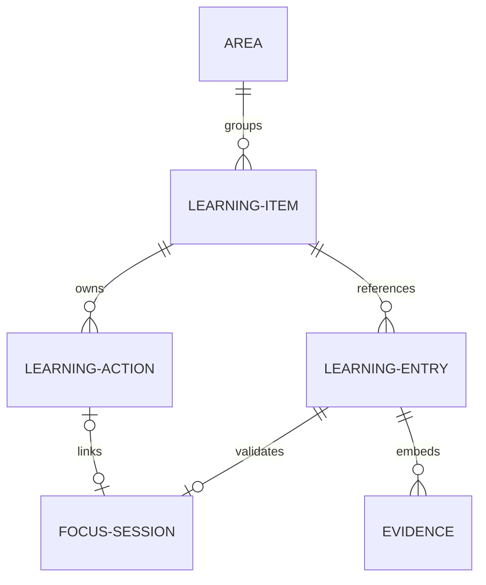
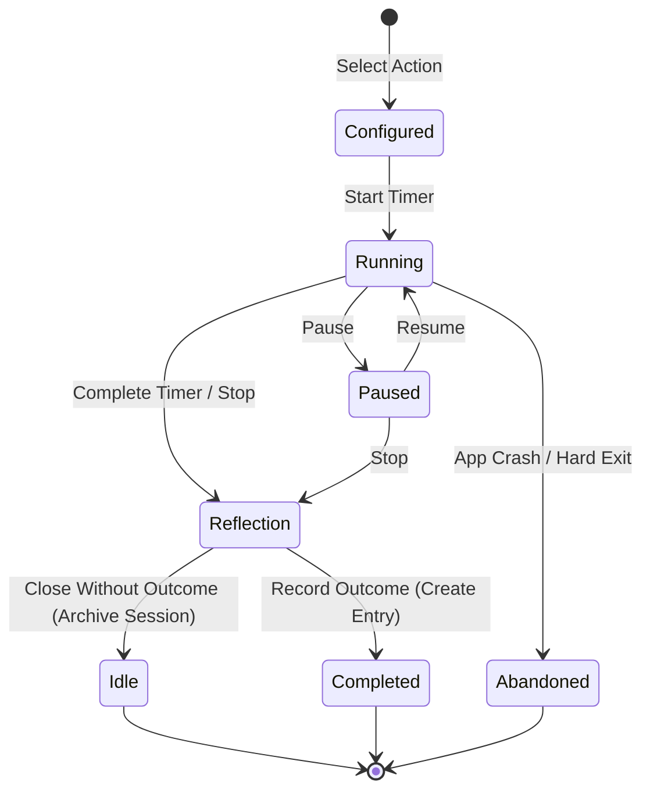
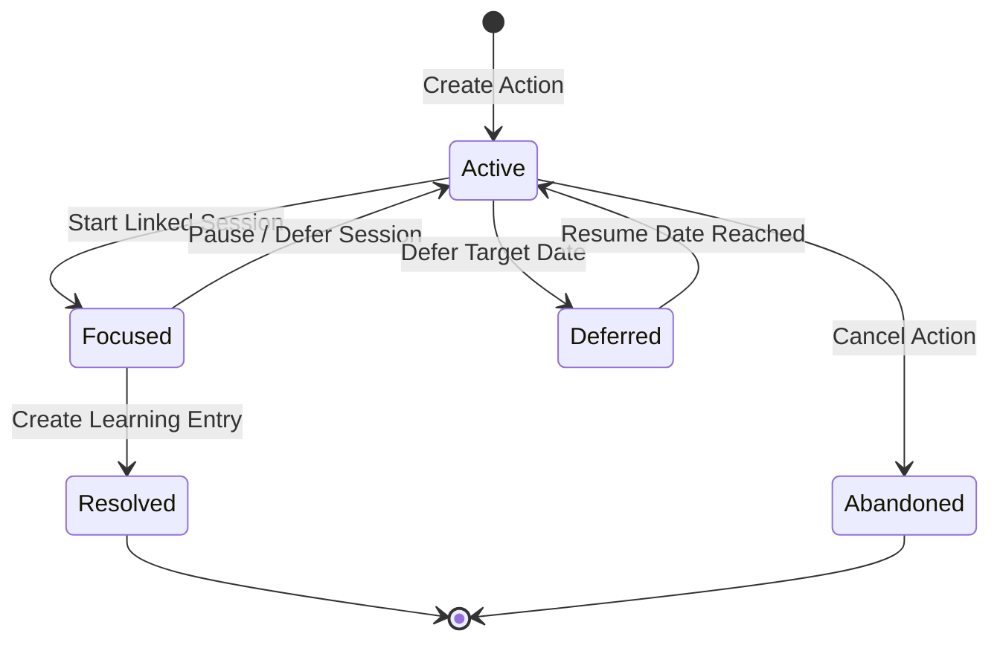
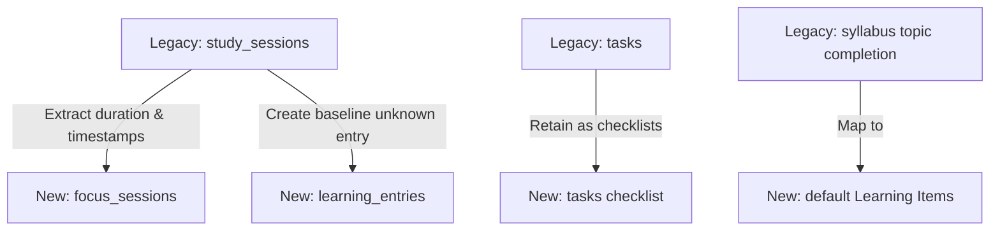

# Learning Record Engineering Contract (LR-0)

This document is the authoritative engineering contract for Project Astra's Learning Record. It translates product-level requirements into software-level constraints, state machines, and boundaries. All future implementation milestones (starting with LR-1) must strictly conform to this contract.

---

## Document Justification

This document is created as a separate file rather than extending [Learning_Record_Architecture_v1.md](file:///c:/Projects/ASTRA/docs/learning-record/Learning_Record_Architecture_v1.md) because of the following long-term architectural reasons:
1. **Separation of Concerns:** [Learning_Record_Architecture_v1.md](file:///c:/Projects/ASTRA/docs/learning-record/Learning_Record_Architecture_v1.md) is a conceptual product document that outlines user behavior, AI restrictions, and pedagogical philosophies. Mixing detailed software engineering state machines, transaction protocols, and recovery code blocks inside it would dilute its readability for product stakeholders.
2. **Onboarding Efficiency:** Engineers implementing the subsystem need a focused, low-noise contract defining exact persistence, lifecycle, and layer ownership rules, free of product prose.
3. **Change Control:** Product conceptual models evolve at a different frequency than software persistence and boundary strategies. Keeping them separate isolates structural modifications.

---

## 1. Core Engineering Principles

Every engineering decision made during implementation must answer: **"What future bug does this decision prevent?"**

1.  **Facts Never Change:** Historical events (completed sessions, recorded outcomes, raw attempts) are immutable. Once persisted, they are never edited or overwritten; corrections are appended as new, timestamped records that supersede old ones.
    *   *What future bug does this prevent?* Prevents audit log corruption, sync race conditions in multi-client setups, and silent AI re-interpretation of historical records.
2.  **Derived Values Are Never Stored:** Quantities that can be calculated dynamically at boot or query time (e.g., study streaks, chapter completion progress, total time, revision schedules) must never be written to database columns.
    *   *What future bug does this prevent?* Prevents out-of-sync state drifts where progress metrics disagree with raw logs after timezone changes, system crashes, or deletions.
3.  **Repositories Own Persistence:** All SQL executions, database clients, and raw storage queries belong exclusively in the Repository layer. No business service or state store may contain database instructions.
    *   *What future bug does this prevent?* Prevents database lock contention, raw connection leaks, and untyped query exceptions from bubbling into UI renders.
4.  **Services Own Business Logic:** Services coordinate intervals, disk writes, backup compression, native OS APIs, and timing states. They must never directly invoke UI render updates or store query states.
    *   *What future bug does this prevent?* Prevents memory leaks, duplicate interval triggers, and thread blocks during asynchronous operations.
5.  **Stores Own UI State:** Zustand stores manage active UI state, routing, transient panels, and reactive view variables. They contain no direct SQLite invocations or file writes.
    *   *What future bug does this prevent?* Prevents state synchronization lag, infinite render loops, and race conditions during fast UI transitions.
6.  **UI Never Owners Truth:** React components render visual representations and bind handlers. They must contain no business calculations, timer loops, or persistence state.
    *   *What future bug does this prevent?* Prevents component state corruption during re-mounts, window resizing, or tab changes.
7.  **AI Never Owners Truth:** AI may suggest, summarize, and propose. It has no authority to mutate any database value, setting, or learning entry without explicit, separate user confirmation.
    *   *What future bug does this prevent?* Prevents "hallucination loops" where AI-generated content automatically corrupts the student's factual academic history.

---

## 2. Domain Vocabulary Specifications

| Concept | Purpose | Ownership | Lifecycle | permanence | Mutability | Responsibilities | Traceability |
|---|---|---|---|---|---|---|---|
| **Area** | Optional organizational container to group related Learning Items. | User / UI Store | Permanent | Permanent | Mutable (name, order) | Groups items for navigation. Must not impose rigid academic rules. | Product Principle 12 (Simpl. and Agency) |
| **Learning Item** | The core anchor. The specific concept, chapter, or skill being studied. | Syllabus / Item Repo | Permanent | Permanent | Mutable (title, group) | Serves as the primary parent anchor for actions and entries. | ADR-0006, LR Arch v1 |
| **Learning Action** | A temporary, student-confirmed intention against one Learning Item. | Action Repo | Temporary | Active until resolved | Mutable (state, intention) | Defines what the student is doing *now* (e.g., solve 10 questions). | ADR-0006, LR UX Section 1 |
| **Focus Session** | Factual timer event tracking elapsed time spent on an action. | Session Repo | Temporary | Permanent once archived | Immutable | Records elapsed seconds, pause logs, start/end timestamps. | Product Principle 8, LR Arch Section 3 |
| **Learning Entry** | The minimal durable factual account of a learning event. | Entry Repo | Permanent | Permanent | Immutable (Corrections are appended) | Records the date, Linked Item, outcome state, and links evidence. | ADR-0004, LR Arch Section 5 |
| **Evidence** | Factual traces of work completed during an entry. | Entry Repo | Permanent | Permanent | Immutable | Holds mock scores, questions attempted, or reference links. | ADR-0004, LR Arch Section 4 |
| **Continuation** | A transient suggestion of where to resume study. | Service Layer | Temporary | Non-persisted (dynamic) | N/A | Computes the next action using latest entries. | LR Arch Section 5, LR UX Section 5 |

---

## 3. Object Relationships & Ownership Map



### Reference & Deletion Boundaries
1.  **Area Deletion:** Deleting an Area must **never** cascade delete its child `Learning Items`. Instead, the items are detached and moved to the "Uncategorized" pool.
    *   *What future bug does this prevent?* Prevents catastrophic loss of years of learning history when a user reorganizes navigation folders.
2.  **Learning Item Deletion:** Learning Items represent core history. Deleting a `Learning Item` performs a soft-delete: the Item is marked archived. If a hard-delete is forced by the user, its linked `Learning Entries` must **not** be deleted. Instead, the entries are detached and reference a null/archived item placeholder so that total study history remains correct.
    *   *What future bug does this prevent?* Prevents total database corruption of lifetime analytics and metrics when a single syllabus topic is removed.
3.  **Action to Entry Creation:** A `Learning Action` is completed by creating a `Learning Entry`. Once completed, the Action is moved to an inactive history log or deleted (if transient), leaving the Entry as the durable fact.
4.  **Session to Entry Linkage:** A `Focus Session` is a raw time log. A `Learning Entry` may reference a `Focus Session` to validate its duration. If a session is completed but the user chooses "Close without recording outcome", the `Focus Session` remains persisted as a raw timeline event, but no `Learning Entry` is created.

---

## 4. Object Lifecycles & State Transitions

### A. Focus Session State Machine


### B. Learning Action State Machine


---

## 5. Persistence Model

To guarantee relational safety and prevent data drift, the persistence model segregates database records from transient memory:

### A. Elements That Must Always Be Persisted
*   `areas`: `id` (uuid), `name` (text), `created_at` (timestamp).
*   `learning_items`: `id` (uuid), `area_id` (uuid, nullable), `title` (text), `source_type` (text - e.g., 'syllabus', 'manual'), `source_ref` (text, nullable), `status` (text - 'active', 'archived').
*   `learning_actions`: `id` (uuid), `item_id` (uuid), `intention_type` (text), `custom_wording` (text), `status` (text - 'active', 'resolved', 'deferred', 'abandoned'), `due_date` (timestamp, nullable), `created_at` (timestamp).
*   `focus_sessions`: `id` (uuid), `action_id` (uuid, nullable), `duration_seconds` (integer), `started_at` (timestamp), `ended_at` (timestamp), `status` (text - 'completed', 'abandoned').
*   `learning_entries`: `id` (uuid), `item_id` (uuid), `session_id` (uuid, nullable), `creator_type` (text - 'student', 'system', 'ai_proposal'), `outcome_state` (text - 'moved_forward', 'partly', 'retry', 'unknown'), `notes` (text, nullable), `created_at` (timestamp).
*   `evidence`: `id` (uuid), `entry_id` (uuid), `evidence_type` (text - 'score', 'completion', 'link'), `value_primary` (real), `value_secondary` (real, nullable), `context_ref` (text, nullable).
*   `entry_corrections`: `id` (uuid), `original_entry_id` (uuid), `corrected_outcome_state` (text), `corrected_notes` (text), `created_at` (timestamp).

### B. Elements That Must Never Be Persisted
*   **Active Countdown Timer Duration:** The current counting second must live purely in UI memory.
*   **Active Pause Logs (Interims):** Raw pausing durations are computed dynamically during the session and resolved into net duration; pause checkpoints are not stored long-term.
*   **Temporary AI Continuation Suggestions:** Draft text suggestions must not occupy database rows.
*   **Cached Streaks/Weekly Progress Metrics:** These are calculated at runtime.

---

## 6. Failure Scenarios & Recovery Guarantees

1.  **Application Crash during Focus Session (Dirty Shutdown):**
    *   *Bug Prevented:* Soft-lock of the focus timer interface or loss of the entire study time record.
    *   *Recovery Guarantee:* Upon application boot, a recovery service scan queries the `focus_sessions` table for any row with an active state but no end timestamp. It automatically updates its status to `'abandoned'`, records the elapsed duration based on `started_at` and the last active interval file checkpoint (written to disk every 60 seconds), and prompts the user: *"We detected an interrupted session of X minutes on [Item]. Would you like to record an outcome or discard it?"*
2.  **Duplicate Entry Submissions (Double Tap):**
    *   *Bug Prevented:* Duplicate database logs which double-count study time and progress in analytics.
    *   *Recovery Guarantee:* Write database constraints using a unique hash composed of `(action_id, timestamp)`. If the frontend attempts a duplicate save, the repository transaction intercepts the SQL constraint error, rejects the second write silently, and returns the existing entry ID.
3.  **OS Crash or Power Loss (Write Interruption):**
    *   *Bug Prevented:* Database corruption or malformed partial files.
    *   *Recovery Guarantee:* All database updates must execute within database transactions (`BEGIN TRANSACTION ... COMMIT`). If the power cuts mid-write, SQLite rollback guarantees that the system returns to the pre-transaction state.
4.  **Multiple Window Instantiation:**
    *   *Bug Prevented:* Race conditions where two windows execute active timer state machines concurrently.
    *   *Recovery Guarantee:* The Tauri native layer executes a single-instance lock. If the user tries to open a second window, it focuses the existing window instead of creating a concurrent execution.
5.  **Synchronization Conflicts (Future Multi-Device):**
    *   *Bug Prevented:* Loss of historical notes due to clock drift overwrite.
    *   *Recovery Guarantee:* Revisions to entries are append-only. If clock drift causes concurrent modifications, both entry corrections are saved with their respective timestamps, and the client displays the conflict: *"Two updates were made to this entry. Select the correct one."*

---

## 7. Engineering Boundaries (One Owner Per Layer)

```
[UI Component]  ──(Store Actions)──>  [Zustand Store]  ──(Service Methods)──>  [Business Service]  ──(Repo Queries)──>  [SQLite Repository]
```

### Responsibility Matrix (No Overlapping Responsibilities)

1.  **Repositories Layer (Owner of Persistence SQL):**
    *   *Responsibility:* Raw database transactions. Converts SQLite row results into TypeScript domain models. Contains **no** business logic, timing states, or UI hooks.
2.  **Services Layer (Owner of Domain Logic):**
    *   *Responsibility:* Coordinates timing loops, file backup routines, Tauri native window bounds, and validates state boundaries. Contains **no** SQL queries, JSX elements, or store hooks.
3.  **Zustand Stores Layer (Owner of Reactive State & Navigation):**
    *   *Responsibility:* Retains memory-resident active values (theme, active session status, current routes). It receives instructions from the Services layer and exposes states reactively to the React UI. Contains **no** raw database calls or timer interval executions.
4.  **UI Component Layer (Owner of Presentation):**
    *   *Responsibility:* Exclusively renders JSX elements and binds user event listeners (clicks, typing) to Store actions. Contains **no** direct service logic or database handles.
5.  **AI Provider Layer (Owner of Summarization/Proposals):**
    *   *Responsibility:* Translates system inputs into suggested actions or summaries. It is completely decoupled from the database; it communicates exclusively through Service interfaces.

---

## 8. Migration Strategy

To transition from the current task-centric prototype to the Learning Record architecture without losing historical student data:



### 1. Legacy Sessions Migration
*   **Contract:** Existing `study_sessions` rows represent elapsed time. The migration script executes a forward-only mapping:
    *   Extract duration and timestamps to populate `focus_sessions`.
    *   For every migrated session, create a default `learning_entry` referencing a mapped `learning_item` with `outcome_state` set to `'unknown'`.
    *   *Rollback Plan:* Maintain the original `study_sessions` table intact as an read-only backup. If the user reverts, the old table is restored.
2.  **Task Decoupling**
*   **Contract:** Existing tasks must be stripped of any progress-mutation side effects. Tasks will no longer contain a column linking them to chapter mastery. Toggling a task checkbox only sets `is_completed = true` in the task table; it is strictly an operational checklist and does not affect the syllabus tree.
3.  **Syllabus Hierarchy Preservation**
*   **Contract:** Mapped syllabus subjects, units, chapters, and topics remain structural database rows. They will act as default seed options for the user when creating a `Learning Item` (the repository links the item's `source_ref` to the topic's UUID). Topic progress is computed dynamically at boot by querying whether at least one `learning_entry` with a `'moved_forward'` outcome state exists for that item.
4.  **Partial Migration Recovery**
*   **Contract:** If a user database migration crashes halfway:
    *   The migration tool wraps all commands in a single database transaction.
    *   Before executing, a complete local safety snapshot `.sqlite.bak` is written to the user's data directory.
    *   If the migration fails, the transaction is rolled back, the app boots using the backup file, and logs a recovery warning in [Bug_Tracker.md](file:///c:/Projects/ASTRA/docs/engineering/Bug_Tracker.md).

---

## 9. Factual Analytics Layering Model

To prevent analytics rendering from polluting raw database truth, metrics compilation must follow a strict one-way dependency model:

```
[Factual Records] ──> [Derived Metrics] ──> [Actionable Insights] ──> [Future AI Interpretation]
```

1.  **Factual Records (Layer 0 - Immutable):**
    *   *Definition:* Raw timestamped records of focus session durations, entry outcomes, and evidence scores.
    *   *Rule:* Never mutated by calculations. This is the absolute truth of student activity.
2.  **Derived Metrics (Layer 1 - Calculated at Runtime):**
    *   *Definition:* Calculations compiled over Layer 0 (e.g., total study time, completion percentages, active revision flags).
    *   *Rule:* Never written to the database. Calculated dynamically in memory when a view demands it.
3.  **Actionable Insights (Layer 2 - Diagnostic Advice):**
    *   *Definition:* Rules-based evaluations pointing to rhythmic patterns (e.g., *"You study relative velocity best in the morning"* or *"Chapter 3 has 3 consecutive retry entries"*).
    *   *Rule:* Always references its source Layer 0 and Layer 1 data. The user can dismiss or override the insight.
4.  **Future AI Interpretation (Layer 3 - Optional Language Layer):**
    *   *Definition:* NLP summaries or natural-language explanations of Layer 2 patterns.
    *   *Rule:* Lies at the outer boundary. AI can read Layer 0, 1, and 2, but has **no** write access back to Layer 0.

---

## 10. LR-1 Implementation Preparation

### A. Recommended Implementation Sequence
1.  **Repository Setup:** Define the relational contracts for `learning_items`, `learning_actions`, `learning_entries`, and `focus_sessions` tables.
2.  **Database Migration (Forward-Only):** Write the SQLite migration script migrating legacy study session rows into focus session and unknown entry records.
3.  **Decouple Task Mutation:** Refactor `TaskIntelligenceService` to ensure task completion event triggers do not write progress values into the syllabus state.
4.  **Atomic Backup & Verification:** Establish the pre-restore backup transaction and file integrity check routines.

### B. Expected Engineering Risks
*   **Clock Tampering:** If a student changes the system clock, raw timestamps will conflict.
    *   *Mitigation:* Services must validate that `ended_at >= started_at` and log a warning if timestamps are backdated.
*   **Database Lockup during Long Queries:** Scale testing shows that queries counting large historical tables can block the Tauri native thread.
    *   *Mitigation:* Optimize database indexes on `learning_entries(item_id, created_at)` and `focus_sessions(started_at)`.
*   **Task Store Race Conditions:** Toggling tasks quickly can trigger multiple event emissions on the in-process event bus.
    *   *Mitigation:* Debounce store actions by 250ms before triggering service refreshes.
