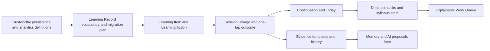

# Learning Record Implementation Roadmap

## Scope

This is an implementation sequence, not a schema or code specification. It should be executed only after the existing Trustworthy Foundation work is planned and verified. Each milestone must meet the Engineering Playbook's UX, philosophy, architecture, performance, and verification reviews.

## Critical path

## Milestone LR-0 — Contract and migration design

**Purpose:** Translate this product architecture into approved domain vocabulary, state transitions, ownership, migration policy, and acceptance tests before any implementation.

**Dependencies:** Product Recalibration v1, ADR-0004, this architecture document.

**Work:**

- Define exact user-visible terms for Item, Action, Entry, outcome, evidence, and continuation.
- Document ownership/depends-on/used-by/must-never-know for each new subsystem.
- Define how legacy sessions, tasks, and syllabus states are preserved without being reinterpreted as mastery evidence.
- Define analytics terms and deletion/correction semantics.

**Unlocks:** Safe schema design and UX work.

**Why this complexity is justified:** It prevents accidental semantic choices from becoming permanent data contracts.

**Exit criteria:** A reviewed implementation plan exists; no unresolved Open Question is silently encoded as fact.

## Milestone LR-1 — Trustworthy factual substrate

**Purpose:** Ensure existing session, analytics, backup, restore, and migration behavior can carry new records safely.

**Dependencies:** LR-0.

**Work:**

- Correct reporting definitions and analytics reconciliation.
- Make backup/export and restore complete, atomic, and verified.
- Establish migration transaction/error behavior and safe correction/deletion conventions.
- Remove inactive companion/insight/memory presentation from primary UI.

**Unlocks:** Trustworthy migration and first Learning Record use.

**Why this comes first:** A new product record is harmful if its history can be lost or reported inaccurately.

**Exit criteria:** Foundation Phase 1 criteria from Product Roadmap v2 are met.

## Milestone LR-2 — Learning Item and Action foundation

**Purpose:** Let a student name what they are learning and confirm what they intend to do now.

**Dependencies:** LR-0 and LR-1.

**Work:**

- Introduce the minimal persistent Item/Action lifecycle.
- Provide a neutral first-run route to create or choose an Item.
- Link existing syllabus nodes as optional Item sources, without requiring JEE hierarchy.
- Preserve manual free-label entry for learning outside any imported curriculum.

**Unlocks:** A coherent start flow and item-level continuation.

**Complexity restraint:** Do not implement universal groups, projects, nested tags, attachments, calendars, or AI-generated taxonomies.

**Exit criteria:** A first-time user can select/name an Item and begin a confirmed Action in under 30 seconds.

## Milestone LR-3 — Session linkage and one-tap outcome

**Purpose:** Connect focused time to an intended action and capture a lightweight truthful outcome.

**Dependencies:** LR-2.

**Work:**

- Link focus sessions to Actions while preserving legacy session history.
- Replace the mandatory-feeling reflection flow with one-tap outcome or close-without-outcome.
- Persist an Entry only when the user leaves a durable outcome/note/evidence; preserve factual session separately when they do not.
- Add correction and deletion behavior for recent entries.

**Unlocks:** The first real Learning Record and tomorrow continuity.

**Why complexity is justified:** This is the minimum bridge between focus and an honest next decision.

**Exit criteria:** A tired user can finish and close in one click; a user who leaves an outcome sees it correctly tomorrow.

## Milestone LR-4 — Continuation-first Today

**Purpose:** Make return to learning easier than reconstructing yesterday's context.

**Dependencies:** LR-3.

**Work:**

- Replace competing dashboard paths with one active continuation and an explicit “choose another” path.
- Define deterministic continuation priority from student cue, unfinished Action, latest partial/retry outcome, unknown prior attempt, and explicit commitment.
- Surface source evidence and allow immediate override.

**Unlocks:** A complete basic learning loop without AI.

**Complexity restraint:** Do not add optimization, calendar scheduling, recommendation scores, or AI language generation.

**Exit criteria:** Users can explain what Astra is asking them to do, why, and how to change it.

## Milestone LR-5 — Decouple task and academic state

**Purpose:** Remove the current shortcut where task toggles mutate topic completion.

**Dependencies:** LR-3 and LR-4.

**Work:**

- Make tasks optional commitments/checklists only.
- Make syllabus state an explicit view over permitted learning evidence and student corrections.
- Rename/reframe current task intelligence as a Work Queue until explanation and override behavior is implemented.
- Update event semantics so emitted facts describe what actually happened.

**Unlocks:** Honest syllabus progress and safe future planning.

**Why complexity is justified:** It removes an active violation of ADR-0004 and prevents corrupted future memory/analytics.

**Exit criteria:** No checkbox alone can declare topic progress; all topic changes have a visible evidence source or student action.

## Milestone LR-6 — Evidence and history refinement

**Purpose:** Support optional numbers, scores, references, and manual learning events without form bloat.

**Dependencies:** LR-3.

**Work:**

- Add progressive evidence capture and manual entry flow.
- Add compact Item history with correction/deletion behavior.
- Validate a small number of domain-specific shortcuts through user research before shipping any templates.

**Unlocks:** Better planning inputs and useful five-year history.

**Complexity restraint:** No attachments, OCR, broad import pipelines, or universal form builder until a concrete use case requires them.

**Exit criteria:** An untimed event can be captured in under 15 seconds; optional evidence never blocks closing.

## Milestone LR-7 — Explainable Work Queue

**Purpose:** Turn Learning Record facts into transparent next-action recommendations.

**Dependencies:** LR-4, LR-5, and enough LR-6 evidence to test reason types.

**Work:**

- Add reason codes, accept/defer/dismiss/edit, and stable recommendation history.
- Start with deterministic reasons only: continuation, explicit commitment, revision due, or unresolved attempt.
- Add weekly plan/review only if it reduces decision burden in testing.

**Unlocks:** Planning Intelligence phase of Product Roadmap v2.

**Complexity restraint:** No opaque optimizer, automatic schedule, or cloud AI plan generation.

**Exit criteria:** Every recommendation has a factual reason and a non-punitive override.

## Deferred beyond this roadmap

- Adaptive Memory: requires stable evidence, provenance, and correction rules.
- AI Companion: requires a narrow proposal use case and offline fallback.
- Insights: requires long-term correct history and a testable action benefit.
- Cross-device sync: requires stable identities, export/restore, conflict semantics, and security model.
- Attachments and media: require storage, encryption, backup, and retention decisions.

## Implementation order summary

1. LR-0 contract and migration design.
2. LR-1 trustworthy substrate.
3. LR-2 Item and Action foundation.
4. LR-3 session linkage and one-tap outcome.
5. LR-4 continuation-first Today.
6. LR-5 task/syllabus decoupling.
7. LR-6 evidence and history refinement.
8. LR-7 explainable Work Queue.

The first product release worth validating is complete at LR-4. It gives Astra a real continuity loop without needing AI, advanced analytics, or adaptive memory.
