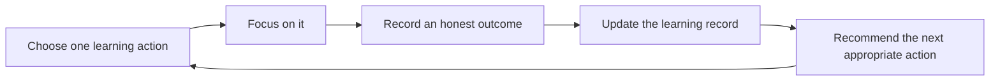

# Astra Product Recalibration v1

## Status and authority

This is Astra's product constitution. It supersedes earlier product wording when that wording is broader, more speculative, or conflicts with the decisions below. Engineering principles remain valid unless this document explicitly changes product direction.

## What Astra is

Astra is a calm, local-first learning workspace that helps a serious student turn a syllabus into the next honest learning action.

It is not defined by a timer, a chatbot, or a dashboard. Its value is the closed loop between intention, focused work, evidence, and the next appropriate decision.

## What Astra is not

- Not a generic productivity suite, second brain, note-taking platform, or social network.
- Not an AI friend, therapist, authority figure, or replacement for a teacher.
- Not an engagement machine built on streak anxiety, guilt, comparison, notifications, or artificial urgency.
- Not a collection of attractive but disconnected focus, memory, sound, and analytics features.
- Not a system that claims mastery, productivity, or personal knowledge without evidence.
- Not a cloud account requirement. The core experience must remain useful without a network connection.

## Who Astra serves first

Astra is initially for serious, self-directed exam students—beginning with desktop-first JEE learners—who have a syllabus, limited time, and difficulty deciding what to do next.

The first user is not a demographic stereotype. They may be returning after a lapse, uncertain about a topic, tired, ambitious, or overwhelmed. Astra must work for the student with a structured curriculum without assuming a fixed name, date, study style, or level of confidence.

Support for other curricula, languages, devices, and accessibility needs is a coverage commitment. It must not be blocked by founder-specific defaults.

## Why Astra exists

Most study tools either track time, store information, schedule tasks, or answer questions. Students still have to assemble those fragments and decide what matters now.

Astra exists to reduce that decision burden without taking away agency. It gives the student a private, understandable record of their learning and helps them choose the next action that moves their plan forward.

## The problem Astra solves

The student should not have to repeatedly answer these questions alone:

1. What should I study next?
2. What did this study block actually move forward?
3. What needs review, practice, or a different approach?
4. Am I progressing toward my stated goal?

Astra solves these questions from student-owned evidence. It does not solve them by pretending elapsed time equals learning.

## The single core learning loop

Every shipped Astra feature must strengthen this loop:

### 1. Choose one learning action

The student starts with a clear, editable action such as: review a concept, solve a problem set, recall a topic, or revise prior material. Astra may recommend an action, but the student confirms it.

### 2. Focus on it

The focus environment protects attention. The timer is a supportive instrument, not the product's measure of achievement.

### 3. Record an honest outcome

At the end of a block, the student records a low-friction outcome: moved forward, partly moved forward, or needs another attempt. Optional notes add context. A task checkbox alone must never imply learning or mastery.

### 4. Update the learning record

Astra records what was intended, what happened, and what evidence exists. Study time, task completion, topic progression, practice performance, and confidence remain distinct facts.

### 5. Recommend the next appropriate action

The system can suggest the next action based on transparent deterministic reasons: unfinished work, a planned commitment, revision due, assessment evidence, or an approaching exam date. The recommendation must be explainable and overridable.

## Feature admission rule

A feature belongs in the active roadmap only if it does at least one of the following:

- makes choosing the next learning action clearer;
- protects focused work;
- captures better learning evidence with less friction;
- improves the accuracy, clarity, ownership, or recovery of the learning record; or
- turns existing evidence into a transparent next action.

Otherwise it is postponed. Soundscapes, visual customization, broad AI chat, dynamic wallpapers, social mechanics, and advanced sync may be good products in isolation; they are not active Astra priorities until the core loop is exceptional.

## Product philosophy

### Trust over spectacle

Correct data, recoverable history, clear explanations, and honest limitations matter more than impressive language or speculative intelligence.

### Evidence over assumptions

The product may distinguish facts, student-reported confidence, deterministic recommendations, and AI suggestions. It must never collapse these into one claim.

### Calm over gamification

Astra helps a student return to work. It does not create compulsive checking. Streaks, celebration, notifications, and metrics are subordinate to learning value and must never punish a lapse.

### Agency over automation

The student owns goals, decisions, and corrections. Astra recommends, explains, and remembers with permission. It does not silently reorder a student's life or declare educational truth.

### One polished experience over ten unfinished surfaces

Inactive companions, empty insights, experimental memory displays, and internal developer tools must not masquerade as core student features.

## AI philosophy

AI is an optional interpretation and language layer over a trustworthy local learning record. It amplifies the loop; it is not the loop.

AI may:

- turn selected evidence into a concise summary;
- explain a deterministic recommendation in plain language;
- propose a task, plan change, or memory for student review;
- help structure student-provided curriculum material.

AI may not:

- mark learning complete or mastery achieved;
- silently change goals, priorities, or records;
- infer personality, mental health, discipline, or capability;
- shame, guilt, manipulate, or create dependence;
- claim certainty without evidence;
- present an invented memory as a fact.

Cloud AI must be opt-in, disclose exactly what leaves the device, and have a useful offline core. An unavailable model must never break session, planning, or recordkeeping.

## Local-first and privacy philosophy

The student's learning record belongs to the student. The core must work offline, persist locally, and be exportable in useful formats.

Privacy is not an excuse for poor product learning. Astra may use opt-in, privacy-preserving diagnostics and research signals if they are transparent, minimal, revocable, and genuinely needed to improve safety or reliability. No hidden behavioral surveillance is acceptable.

Backup and restore are product promises, not settings features. A user must be able to recover their complete learning record safely.

## Design philosophy

- The main screen answers one question: what is the next useful action?
- The focus screen removes everything unrelated to that action.
- Reflection is brief, optional where possible, and earned by its effect on a future decision.
- Information hierarchy beats ornament.
- Motion is quiet, optional, and never required to understand status.
- Keyboard, assistive technology, low-contrast sensitivity, and small screens are product requirements, not polish.

## Product pillars

1. **Trustworthy learning record** — complete, correct, recoverable, and understandable.
2. **Clear next action** — an actionable recommendation with an explanation and override.
3. **Protected focus** — a quiet environment that serves the selected action.
4. **Meaningful evidence** — time is recorded, but learning outcome and revision need remain distinct.
5. **Respectful intelligence** — AI proposes and explains; the student decides.

## Success metrics

Metrics are instruments for improving the student experience, not engagement targets. Where collection is needed, use consented, privacy-preserving, aggregate measurement.

### Core outcome metrics

- Percentage of planned learning actions that receive an honest outcome.
- Percentage of recommendations accepted, overridden, deferred, or dismissed—with stated reason where voluntarily supplied.
- Weekly planned-versus-completed learning actions.
- Revision actions completed when due.
- Student-reported clarity: “I knew what to do next.”
- Student-reported trust: “Astra's record of my work is accurate.”

### Reliability metrics

- Session-record durability after interruption.
- Restore success rate and post-restore integrity verification.
- Analytics reconciliation rate against raw records.
- Migration success and recovery success rate.

### Product-health metrics

- Week-one and week-four return after a completed learning loop, not raw screen time.
- Returning after a lapse without churn.
- Percentage of active users who export or successfully verify a backup.

## Failure metrics

The following are product failures even if usage rises:

- Incorrect time, progress, streak, or recommendation explanations.
- Lost or partially restored learning records.
- AI claims unsupported by source evidence.
- Increased anxiety, compulsive checking, guilt, or avoidance attributed to Astra.
- Student confusion about what a task completion, topic completion, and mastery state mean.
- Features that draw attention away from focused learning without improving a later decision.
- A student needing an account, network connection, or external AI service for the core loop to work.
